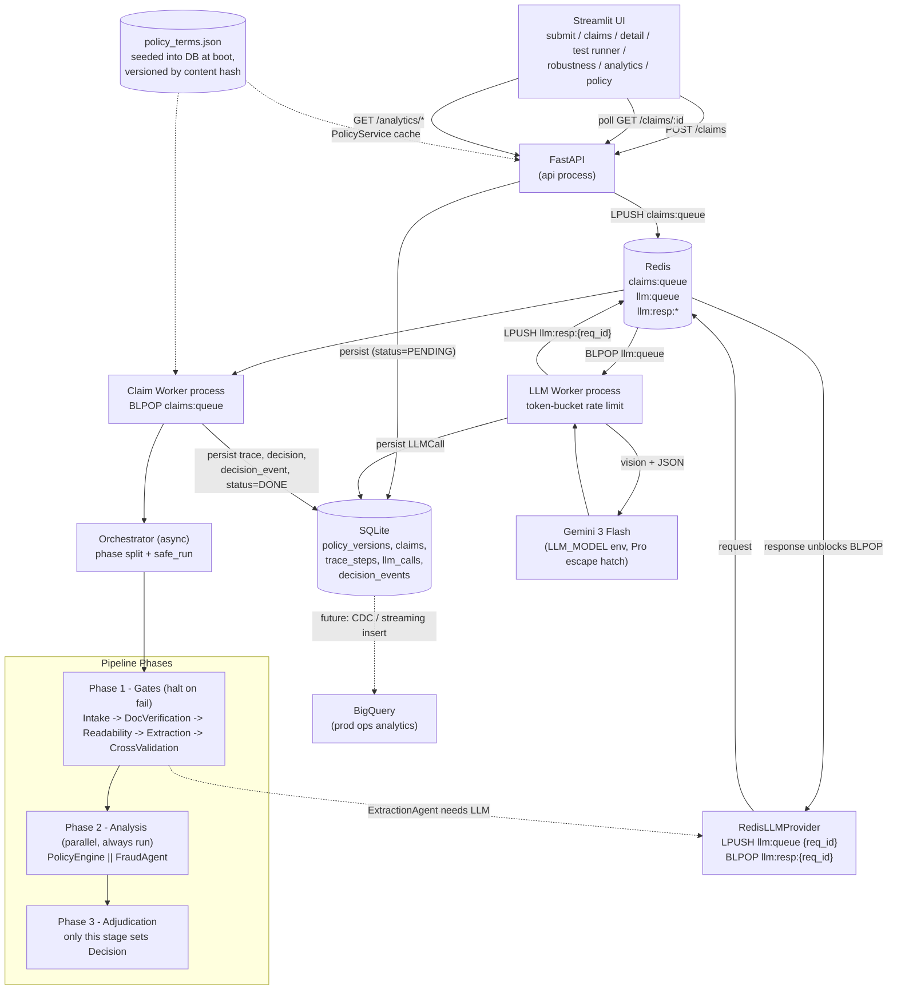
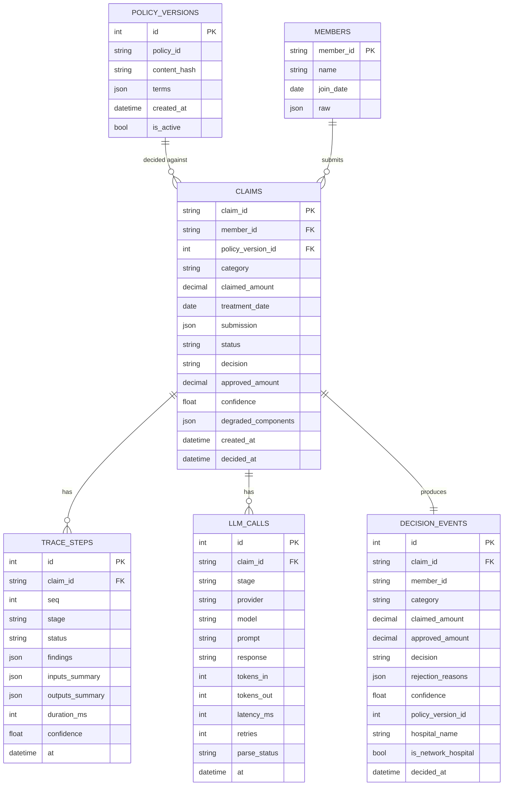
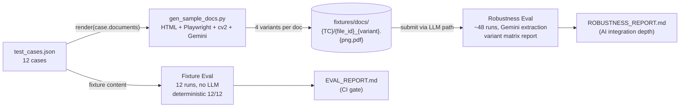

# Plan — Multi-agent Claims Pipeline

**Overview.** Ship a multi-agent health insurance claims processing system in one day: FastAPI + Streamlit + Redis (claim queue + LLM queue) + dedicated claim and LLM workers + SQLite (versioned policy + two-level trace) + Gemini, with deterministic adjudication, ops/LLM trace separation, BigQuery-ready decision events, fixture eval (12/12) plus 48-run document-variant robustness eval, and architecture/contracts docs.

## North star

> **LLM for messy perception. Code for rupees and eligibility. Every step traced. Failures degrade confidence, not the process.**

We ship exactly that, cleanly, and back it with `pytest` over the official 12 cases. Nothing more.

Scoring weights to optimize against (from [assignment.md](assignment.md)): System Design 30, Engineering 25, Observability 20, AI Integration 15, Document Verification 10. Our plan attacks the top three first.

---

## Architecture



**Key design choices** (each interview-defensible in one sentence):

- **Phase split (gate / observe / decide)** gives a cleaner trace narrative than a fully short-circuiting graph and makes ops-team review trivial: trace reads top-to-bottom in three blocks.
- **Only `AdjudicationAgent` writes the `Decision`.** Every other agent contributes findings only. This is the single most important convention for explainability.
- **Deterministic financial math** in `policy_engine.py`, never in an LLM. Aligns with "do not hardcode policy logic" by reading everything from the seeded policy version.
- **Two-tier producer/consumer over Redis**: API -> claim worker (claims:queue) and claim worker -> LLM worker (llm:queue + correlation-ID response keys). LLM is its own worker pool so provider rate limits live in one place, LLM latency never blocks claim intake, and the two pools scale independently. DB remains source of truth; Redis carries only correlation IDs and small payloads — exactly the pattern from [design.md](design.md).
- **Two-level tracing**: `TraceStep` (ops/finance human-readable findings) and `LLMCall` (engineering: prompt, tokens, latency, retries). Different audiences, different schemas, joined by `claim_id`.
- **Versioned policy in DB**: `policy_versions` keyed by content hash, immutable. Each `ClaimRecord` stores `policy_version_id`, so old claims forever decode against the rules they were judged under, even after policy updates.
- **`safe_run` decorator** wraps each agent: exception -> failed `TraceStep` + `degraded_components` + confidence decay. TC011 simulation raises inside `FraudAgent`.
- **`ContextVar`-based tracers** so adapters don't thread a tracer parameter everywhere.
- **No LangGraph, no LangChain.** Hand-written async pipeline; we own orchestration. Listed as "rejected for v1" in `ARCHITECTURE.md`.

---

## Component contracts (high-level, full version goes to `COMPONENT_CONTRACTS.md`)

- `IntakeAgent`: in `ClaimSubmission` -> out `ctx.member`, `ctx.category_config`. Halts with `INVALID_MEMBER` / `INVALID_CATEGORY` / `STALE_SUBMISSION`.
- `DocumentVerificationAgent`: validates `document_requirements[category]` from active policy. Halts with `WRONG_DOCUMENTS`, message names what was uploaded vs required (TC001).
- `ReadabilityAgent`: checks `quality == UNREADABLE` per doc. Halts with `NEEDS_REUPLOAD` naming the specific file (TC002). Never `REJECTED`.
- `ExtractionAgent`: if `content` provided -> normalize; else call `LLMProvider.extract(image, schema)` with Pydantic schema -> structured `ExtractedDoc`. Per-field confidence. Every call recorded as `LLMCall`.
- `CrossValidationAgent`: patient name match across docs, treatment_date alignment, doctor reg-id regex per [sample_documents_guide.md](sample_documents_guide.md) formats. Halts with `PATIENT_MISMATCH` naming both names (TC003).
- `PolicyEngine` (deterministic): waiting periods, exclusions (top-level + dental + vision), pre-auth threshold, sub-limit, per-claim limit, network detection. Returns ordered findings, never a final decision.
- `FraudAgent`: same-day count, monthly count, high-value threshold from `fraud_thresholds`. Returns weighted score + signals.
- `AdjudicationAgent`: applies financial ordering **strictly**: line-item exclusion filter -> network discount -> co-pay -> sub-limit cap -> per-claim cap -> annual remaining -> branch to `APPROVED` / `PARTIAL` / `REJECTED` / `MANUAL_REVIEW`. The TC010 ordering is a unit test. Emits the final `decision_events` row.

---

## Data model



`decision_events` is the **denormalized BigQuery-shaped fact table**: one row per claim decision, every column a finance person needs, no joins required.

---

## SQLite vs MongoDB (verdict and rationale)

| Dimension | SQLite | MongoDB |
|---|---|---|
| Setup cost | Zero file in repo | Docker / Atlas + setup |
| Policy/members/claims metadata fit | Excellent (relational, FKs) | Workable but no FKs |
| Extracted-doc shape fit | OK (`JSON` column, Pydantic-validated anyway) | Native |
| Cross-table ACID (claim + trace + llm_call + decision_event) | Yes | Cross-doc txns exist, heavier |
| Grader experience | Clone + run | Needs `docker compose up` |
| Analytics export to BigQuery | `sqlite-utils dump` -> CSV -> `bq load` | `mongoexport` -> CSV |
| Production migration | Postgres (drop-in via SQLAlchemy) | Atlas / sharded cluster |

**Verdict: SQLite for v1.** Our shape is mostly relational; nested bits are bounded by Pydantic so Mongo's schemaless advantage doesn't apply. ARCHITECTURE.md's scaling section names Postgres as the v2 target, with Mongo only if extraction shapes diverge per document type.

---

## Dual eval design (fixture vs robustness)

Two complementary surfaces, two reports, one orchestrator:

- **Fixture eval** — `scripts/run_eval.py` -> `docs/EVAL_REPORT.md`. Uses the structured `content` field already in [test_cases.json](test_cases.json), bypassing the LLM. **Deterministic, 12/12 expected, this is the CI gate.** Proves the policy + adjudication + halt logic is correct.
- **Robustness eval** — `scripts/run_robustness_eval.py` -> `docs/ROBUSTNESS_REPORT.md`. For each of TC004-TC012 (the cases with real document content), generate 4 image variants and run the **real Gemini extraction path** end-to-end. 48 runs total.



**Variant generation** (HTML + Playwright + cv2 + Gemini image gen):

Single source of truth: Jinja2 HTML templates per doc type (`prescription`, `hospital_bill`, `lab_report`, `pharmacy_bill`) fed structured content from [test_cases.json](test_cases.json). Every variant flows from the same template so patient name, doctor, line items, and totals are byte-identical across variants — that's how the eval stays reliable.

- `clean PNG` — Playwright `page.screenshot()` of rendered HTML. Pixel-perfect, exact content.
- `clean PDF` — Playwright `page.pdf()` from the same HTML. Used as the variant for ~2 test cases (instead of PNG) to exercise the PDF code path. Gemini 3 Flash accepts PDFs natively.
- `phone_photo PNG` — cv2 on clean PNG: 4-corner perspective skew + contrast 0.7 + radial shadow gradient + 1-2 px Gaussian blur. Deterministic.
- `blurry PNG` — cv2 on clean PNG: Gaussian blur radius 4-8 + Gaussian noise sigma 8. Deterministic.
- `handwritten PNG` — Gemini image generation (`gemini-2.0-flash-preview-image-generation` / Imagen). Prompt anchors the exact fields ("doctor=Dr. Arun Sharma, patient=Rajesh Kumar, diagnosis=Viral Fever, medicines=..."). **Post-generate content-fidelity check**: run our own `ExtractionAgent` against the output, assert key fields match source; on mismatch, fall back to HTML rendered with Caveat font (deterministic, less realistic but always faithful). Prevents Gemini hallucinations from poisoning the eval.

Fixtures are **committed to git** under `fixtures/docs/` so graders run pytest + robustness eval without ever installing Chromium or paying for image generation. `gen_sample_docs.py` is the maintainer tool to regenerate.

**Pass criteria (honest, not naive)**:
- Halt cases (TC001/TC002/TC003/TC011): variant must not change the halt reason. If the LLM cannot extract from a blurry handwritten doc, that maps to `NEEDS_REUPLOAD`, which is the **right answer** — extraction failure is a document problem, not a policy rejection.
- Decision cases (TC004-TC010, TC012): `decision` matches; `approved_amount` within ±5% tolerance; `confidence` is allowed to drop on degraded variants — that **is** the assignment §6 behavior.
- A variant that reports `degraded_components: ["ExtractionAgent"]` + lower confidence + manual-review note has *passed* the resilience test, not failed it.

**Report format**:

```
| Case  | clean              | handwritten       | phone_photo       | blurry              |
|-------|--------------------|-------------------|-------------------|---------------------|
| TC004 | APPROVED 1350 .94  | APPROVED 1350 .82 | APPROVED 1350 .76 | NEEDS_REUPLOAD .40  |
| TC006 | PARTIAL  8000 .91  | PARTIAL  8000 .79 | PARTIAL  8000 .73 | PARTIAL 8000 .58 *  |
| ...   |                    |                   |                   |                     |
| Pass  | 9/9                | 9/9               | 8/9               | 6/9 (3 NEEDS_REUPLOAD)|
```

Below the matrix, per-case detail with full ops trace excerpts. Honest narrative on which variants degraded which fields.

---

## Observability story (the 20% rubric category)

Two-level tracing serves two distinct audiences:

- **Ops/finance (`TraceStep`)** — the trace someone reading a claim sees. "Network hospital detected. 20% discount applied: ₹4,500 → ₹3,600. 10% co-pay applied: ₹360 deducted. Final approved: ₹3,240." Streamlit Claim Detail renders this as a vertical timeline with status pills, durations, and confidence per step.
- **Engineering (`LLMCall`)** — full prompt, response, model, tokens, latency, retries, parse status. Hidden behind a "Show LLM details" expander. Different teams use different views without drowning each other in noise.

The `decision_events` table is the **third surface**: aggregate analytics. Streamlit's Analytics tab queries it directly for v1 (claims/day, decision mix, top rejection reasons, avg approved by category). For prod scale, the same table ships to BigQuery via Postgres CDC (Debezium) or a streaming insert from the worker — both options documented in ARCHITECTURE.md.

### Confidence aggregation (F1-style harmonic mean)

Per-step confidence is emitted by every agent into its `TraceStep`. Overall claim confidence is the **harmonic mean** of step confidences — same family as F1 — so a single weak link can't be averaged out by confident neighbours. This is the right risk semantic for an audit-grade pipeline.

```
overall_confidence = n / sum(1 / max(c_i, eps) for c_i in step_confidences)
```

- `eps = 0.01` floor avoids divide-by-zero while still letting near-zero values dominate.
- **Degraded or skipped agent** (TC011 path): contributes a `penalty_confidence` (default `0.5`) rather than being skipped, so degradation always surfaces in the headline number. Recorded in trace as `confidence: 0.5 [degraded penalty applied]`. A 0.5 mixed with four 0.95s drops overall from ~0.95 to ~0.78 — the assignment §6 behavior, made mechanical.
- **Halt outcomes**: compute over steps that actually ran; for halts the user-facing message matters more than the confidence number, but it's still recorded.
- Lives in `claims_pipeline/pipeline/confidence.py` with full unit-test coverage in `test_confidence.py`. Adjudication agent reads `tracer.harmonic_confidence()` and stores it on `ClaimRecord.confidence`.

---

## Tech stack

- **Backend**: FastAPI, Pydantic v2, SQLAlchemy + SQLite, `uvicorn`. Producer/consumer over Redis using plain `redis-py` `BLPOP` (no Celery).
- **Workers**: two Python processes, both consume-loops, same codebase:
  - `python -m claims_pipeline.workers.claim_worker` — `BLPOP claims:queue` -> orchestrator -> persist
  - `python -m claims_pipeline.workers.llm_worker` — `BLPOP llm:queue` -> rate-limit -> Gemini -> persist `LLMCall` -> `LPUSH llm:resp:{req_id}`
- **Frontend**: **Streamlit** single app with sidebar nav (Submit / Claims / Detail / Test Runner / Robustness / Analytics / Policy). Calls FastAPI via `httpx`. `st.session_state` for polling.
- **LLM**: `LLMProvider` ABC kept deliberately generic so a GPT-5+ or Claude-4+ adapter is a drop-in. We ship one concrete impl:
  - `GeminiProvider` — `gemini-3-flash-preview` (May 2026), vision + `response_json_schema` + Pydantic validation. Used by tests, robustness eval, and the LLM worker.
  - `RedisLLMProvider` — async; LPUSH request, BLPOP response with timeout. Used by the claim worker's orchestrator at runtime. (This is the *transport* — wraps any underlying LLMProvider on the worker side.)
- **Model**: `LLM_MODEL` env var. Default `gemini-3-flash-preview` — sufficient for structured extraction from rendered medical documents, ~5-10x cheaper and faster than Pro. `gemini-3.1-pro-preview` is the escape hatch if Flash misclassifies a variant in the robustness eval; the empirical answer beats over-spec'ing the model up front.
- **Infra**: `docker-compose.yml` can bring up **Redis only** for local dev or the **full stack** (Redis + API + both workers + Streamlit via [`Dockerfile`](Dockerfile)). One `.env` for `GEMINI_API_KEY`, `LLM_MODEL`, `REDIS_URL`, `DATABASE_URL`, `LLM_RATE_LIMIT_RPM` (cost-control + provider-friendly throttle, not a free-tier hack).
- **Tests**: `pytest` + `pytest-asyncio`. Suites: official 12 cases (in-process, no Redis, no LLM — fixture content), policy-engine units, pipeline degradation, policy versioning, RedisLLMProvider timeout path.
- **Eval**: `scripts/run_eval.py` (fixture, in-process, 12/12 CI gate) and `scripts/run_robustness_eval.py` (12 x 4 variants via direct GeminiProvider, ~48 runs, writes ROBUSTNESS_REPORT.md).
- **Out of scope for v1**: auth, Postgres, Celery, Kubernetes, real BigQuery export, autoscaling worker pools. Each documented in `ARCHITECTURE.md` "Considered and rejected" with the migration path.

---

## Repo layout

```
src/
  claims_pipeline/         # one installable package (`pip install -e .`)
    main.py                # FastAPI app + routes
    ui/app.py              # Streamlit (httpx → API)
    db.py
    schemas.py
    policy.py
    queue.py
    workers/
      claim_worker.py
      llm_worker.py
    pipeline/
      orchestrator.py
      tracer.py
      confidence.py
      agents/ ...
    llm/
      base.py
      gemini.py
      redis_provider.py
    analytics.py
scripts/                   # repo root (eval helpers)
  run_eval.py
  run_robustness_eval.py
  gen_sample_docs.py
tests/
  test_official_cases.py
  test_policy_math.py
  test_degradation.py
  test_policy_versioning.py
  test_confidence.py
fixtures/
  docs/                    # optional generated doc images for robustness
policy_terms.json
test_cases.json
docs/
  ARCHITECTURE.md
  COMPONENT_CONTRACTS.md
  EVAL_REPORT.md             # generated
  ROBUSTNESS_REPORT.md       # generated
Dockerfile
docker-compose.yml           # Redis only OR full stack (see README)
.env.example
README.md                    # quickstart: 4 commands (compose up redis, run api, run worker, run ui)
```

---

## What gets cut (and why — to defend in interview)

- **Real OCR on noisy phone photos**: scoped to "Gemini vision JSON extraction"; harder OCR (handwriting, stamps over text) called out as a known limitation. Production path: a dedicated OCR pre-pass (Textract / Document AI) feeding the same `ExtractionAgent` schema.
- **Auth / multi-tenant**: single demo policy, single roster from [policy_terms.json](policy_terms.json). Production path: tenant_id on every table, RLS at Postgres.
- **Postgres + migrations**: SQLite for v1; SQLAlchemy means switching the URL is the only code change. Listed as the v2 step.
- **Real BigQuery integration**: we ship the `decision_events` table in BigQuery shape and a CSV export. Streaming insert / CDC are documented, not built.
- **LangGraph / LangChain**: pipeline is linear with one parallel fan-out; framework adds debugging cost without value here.
- **Celery / Arq**: `redis-py` `BLPOP` is one screen of code and removes a dependency. We can swap up if retries/scheduling become real needs.

These cuts go in `ARCHITECTURE.md` under "Considered and rejected" — explicit trade-off literacy is a strong hire signal.

---

## Order of execution

1. Backend skeleton: FastAPI + SQLAlchemy + DB schema (5 tables) + Pydantic schemas + Redis client wrappers + two-tier tracer + `safe_run`. Foundation everything else depends on.
2. Policy seeding: hash-based versioning, `PolicyService` cache, `policy_version_id` FK on `claims`.
3. Deterministic agents (the 7 non-LLM ones). These alone pass 11/12 cases when called in-process with fixture content.
4. Orchestrator + claim worker entry point. Wire TC011 simulated `FraudAgent` failure. Confirm 12/12 with `pytest` against fixture `content` (in-process, no Redis, no LLM).
5. `GeminiProvider` (direct), wired into `LLMTracer`. Smoke-test with one clean Pillow-rendered image.
6. `RedisLLMProvider` + `llm_worker` (token-bucket rate limit, BLPOP/LPUSH correlation). End-to-end smoke: API enqueues, claim worker runs orchestrator with RedisLLMProvider, LLM worker handles extraction, decision persisted. Add a unit test for the timeout path -> LLMTimeoutError -> safe_run -> degraded_components.
7. `gen_sample_docs.py`: Jinja2 HTML templates -> Playwright PNG/PDF -> cv2 transforms -> Gemini handwritten generation with content-fidelity verification. Output committed to `fixtures/docs/`. One-time maintainer step; graders use the cached fixtures.
8. FastAPI routes including `/analytics/decisions`, CSV export, `/eval/robustness`, `/admin/policy`, `/admin/claims/{id}/requeue`.
9. Streamlit app: Submit, Claims, Detail (timeline + waterfall + LLM expander), Test Runner, Robustness (variant matrix), Analytics, Policy.
10. Generate `EVAL_REPORT.md` (fixture, 12/12). Run `run_robustness_eval.py` to generate `ROBUSTNESS_REPORT.md` (48 direct-Gemini runs, variant matrix). Tune Gemini prompt if any clean variants fail; degraded variants degrade *honestly*, no prompt-stuffing.
11. Write `ARCHITECTURE.md` (two-tier queue rationale, two-level tracing, dual-eval design, SQLite-vs-Mongo, BigQuery export design, considered-and-rejected, 10x scaling notes) and `COMPONENT_CONTRACTS.md`.
12. Record demo video: TC001 doc rejection, TC004 full approval through full Redis path showing both worker logs side by side, Robustness tab (variant matrix), Analytics tab, one decision proud of (two-tier queue + two-level tracing + variant robustness eval) + one to change (Postgres + BigQuery streaming + real OCR pre-pass).

---

## Todo checklist

- [ ] **scaffold** — Scaffold backend (FastAPI, SQLAlchemy, redis, pytest, pydantic-settings) and Streamlit app. Wire `.venv`, `requirements.txt`, `docker-compose.yml` for Redis. README quickstart with four-process layout (api / claim_worker / llm_worker / ui).
- [ ] **db-schema** — SQLAlchemy schema. Tables: `policy_versions` (immutable, content hash), `members`, `claims`, `trace_steps` (ops view), `llm_calls` (engineering view), `decision_events` (denormalized, BigQuery-shaped, append-only). Pydantic mirror models.
- [ ] **policy-seed** — On API startup, hash `policy_terms.json` contents; if no `policy_versions` row matches, insert a new version. `ClaimRecord` stores `policy_version_id` (FK). Admin endpoint `POST /admin/policy` uploads new version. `PolicyService` loads active version into memory cache.
- [ ] **tracer** — Two-tier tracer. `ContextVar`-based `OpsTracer` emits `TraceStep` (stage, status, findings, inputs/outputs summary, duration_ms, confidence). `LLMTracer` emits `LLMCall` (prompt, response, model, tokens, latency, retries, parse_status). Both write to DB; events also published to Redis channel `claims:{id}:events`. `safe_run` decorator + `degraded_components` + per-step confidence. Overall confidence aggregated via harmonic mean (F1-style); degraded steps contribute a penalty (default 0.5); epsilon floor 0.01.
- [ ] **agents-deterministic** — 7 deterministic agents: `IntakeAgent`, `DocumentVerificationAgent` (TC001 specific message), `ReadabilityAgent` (TC002 `NEEDS_REUPLOAD`), `CrossValidationAgent` (TC003 name diff), `PolicyEngine` (waiting/exclusion/pre-auth/limits), `FraudAgent` (same-day/monthly/high-value), `AdjudicationAgent` (TC010 financial ordering).
- [ ] **orchestrator-claim-worker** — Async Orchestrator with phase split. Claim worker (`claims_pipeline.workers.claim_worker`) `BLPOP`s `claims:queue`, runs orchestrator with the injected `LLMProvider`, persists trace + decision + decision_event. API enqueues. TC011 hook simulates `FraudAgent` failure.
- [ ] **llm-worker-and-provider** — `LLMProvider` ABC kept generic. `GeminiProvider` implements `gemini-3-flash-preview` (vision + `response_json_schema` + Pydantic validation). `RedisLLMProvider` (LPUSH `llm:queue` with `req_id`, BLPOP `llm:resp:{req_id}` with timeout) used by claim worker. LLM worker `BLPOP`s `llm:queue`, applies token-bucket rate limit, calls Gemini, writes `LLMCall`, LPUSH response. Timeout/error -> `LLMTimeoutError` -> `safe_run` -> `degraded_components`.
- [ ] **tests** — `test_official_cases.py` (12 TCs, in-process, fixture content), `test_policy_math.py` (TC010 ordering, sub-limit, line-item filter), `test_degradation.py` (TC011 harmonic-mean drop with penalty value, no crash), `test_policy_versioning.py`, `test_confidence.py` (harmonic mean unit tests).
- [ ] **api-routes** — `POST /claims`, `GET /claims/:id`, `GET /claims`, `GET /policy/active`, `GET /policy/versions`, `POST /admin/policy`, `POST /eval/run` (fixture), `POST /eval/robustness` (LLM), `GET /analytics/decisions`, `GET /analytics/decisions.csv`, `GET /health`.
- [ ] **streamlit-ui** — Sidebar nav: Submit / Claims / Detail (ops trace timeline + financial waterfall + member message + collapsed LLM trace expander) / Test Runner / Robustness (variant matrix) / Analytics (claims/day, decision mix, top rejection reasons, CSV download) / Policy.
- [ ] **doc-variants** — Jinja2 HTML templates per doc type fed from `test_cases.json`. Variants: clean PNG (Playwright), clean PDF (~2 cases), `phone_photo` PNG (cv2), `blurry` PNG (cv2), `handwritten` PNG (Gemini image gen with content-fidelity verification, fall back to Caveat-font HTML on mismatch). Output committed to `fixtures/docs/`.
- [ ] **eval-report-fixture** — `scripts/run_eval.py` runs 12 TCs in-process, writes `docs/EVAL_REPORT.md`. Verify 12/12 deterministic.
- [ ] **robustness-eval** — `scripts/run_robustness_eval.py` runs 48 variant images through real Gemini extraction. Writes `docs/ROBUSTNESS_REPORT.md` with summary matrix + per-case detail + honest narrative.
- [ ] **architecture-docs** — `docs/ARCHITECTURE.md` (components, data flow, two-level tracing rationale, dual-eval design, SQLite vs MongoDB, BigQuery export design, considered-and-rejected, 10x scaling notes) and `docs/COMPONENT_CONTRACTS.md`.
- [ ] **demo-video** — 8-12 min: TC001 doc rejection with specific message, TC004 full approval through Redis path showing worker logs, Robustness tab, Analytics tab, one decision proud of + one to change.
