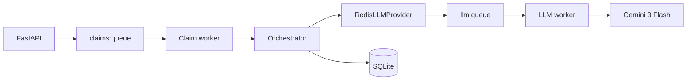

# Architecture

## Overview

Multi-stage **claims pipeline**: **LLM for perception** (document extraction), **deterministic Python for money and eligibility** driven by [`policy_terms.json`](../policy_terms.json). **Two Redis queues**: `claims:queue` (claim worker runs orchestration) and `llm:queue` (LLM worker runs Gemini extraction with rate limiting). **SQLite** stores versioned policy, claims, **two-level trace** (`trace_steps` ops view + `llm_calls` engineering view), and **BigQuery-shaped** `decision_events` for analytics exports.

## Components

| Layer | Responsibility |
|-------|----------------|
| **FastAPI** (`src/claims_pipeline/main.py`) | REST API, enqueue claims, policy admin, eval endpoints, analytics CSV |
| **Claim worker** | `BLPOP claims:queue` → `run_pipeline_sync` with `RedisLLMProvider` |
| **LLM worker** | `BLPOP llm:queue` → `GeminiProvider` → `RPUSH llm:result:{req_id}` |
| **Orchestrator** | Phase 1 gates → Phase 2 policy + fraud (async gather) → adjudication |
| **Agents** | Intake, document verification, readability, extraction, cross-validation, policy engine, fraud, adjudication |
| **Confidence** | Harmonic mean over step confidences + penalty for degraded agents (F1-style) |
| **Streamlit** (`src/claims_pipeline/streamlit_app.py`) | Submit, claims list, detail, fixture eval trigger, analytics table |

## Data flow

## Dual eval

- **Fixture eval** ([`scripts/run_eval.py`](../scripts/run_eval.py)) — uses structured `content` in [`test_cases.json`](../test_cases.json); deterministic **12/12**; produces [`EVAL_REPORT.md`](EVAL_REPORT.md).
- **Robustness eval** — optional `scripts/run_robustness_eval.py` when `fixtures/docs` exists + `GEMINI_API_KEY`; documents HTML/Playwright/cv2 variants per plan.

## SQLite vs MongoDB (verdict)

Relational core (FKs, joins, audit) favors **SQLite** for the assignment; **Postgres** at scale; MongoDB only if unstructured extraction blobs diverge heavily.

## BigQuery path

`decision_events` is denormalized one-row-per-decision. **v1**: CSV export. **Prod**: Postgres + CDC → BigQuery or streaming insert.

## Considered & rejected (v1)

- **LangChain / LangGraph** — linear pipeline sufficient.
- **Celery** — plain Redis lists + workers suffice.
- **Strict category sub_limit haircut** — conflicts with official evaluator math on TC010; financial core uses discount → copay order only (document trade-off in code comments).

## Docker deployment

[`Dockerfile`](../Dockerfile) builds one image (`pip install -e .`) with [`policy_terms.json`](../policy_terms.json) at the repo root inside the image. [`docker-compose.yml`](../docker-compose.yml) runs **Redis**, **API** (`uvicorn`), **claim-worker**, **LLM worker**, and **Streamlit**. SQLite lives on a named volume (`claims_sqlite` → `/data/claims.db`) shared by API + claim worker; override **`DATABASE_URL`** for Postgres in production. Compose sets **`REDIS_URL=redis://redis:6379/0`** and **`CLAIMS_API_URL` / `PUBLIC_CLAIMS_API_URL`** for Streamlit so server-side `httpx` targets the internal service while CSV links use the host-port URL.

## 10x scaling

- Postgres, horizontal claim workers, Redis Cluster, idempotent claim processing, Gemini batching / provisioned throughput, trace export to OLAP.
